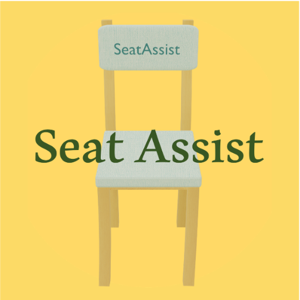
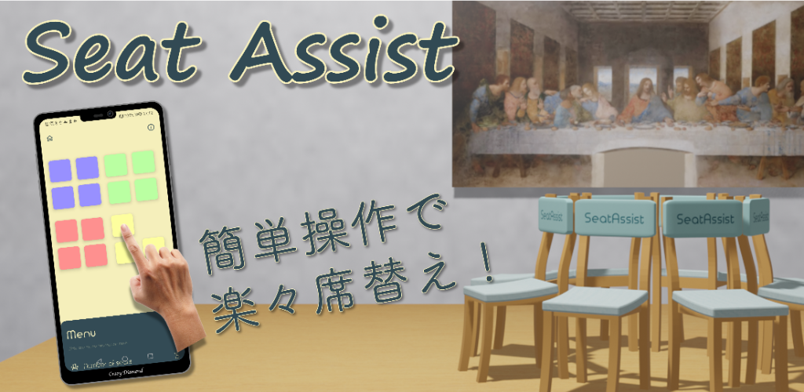
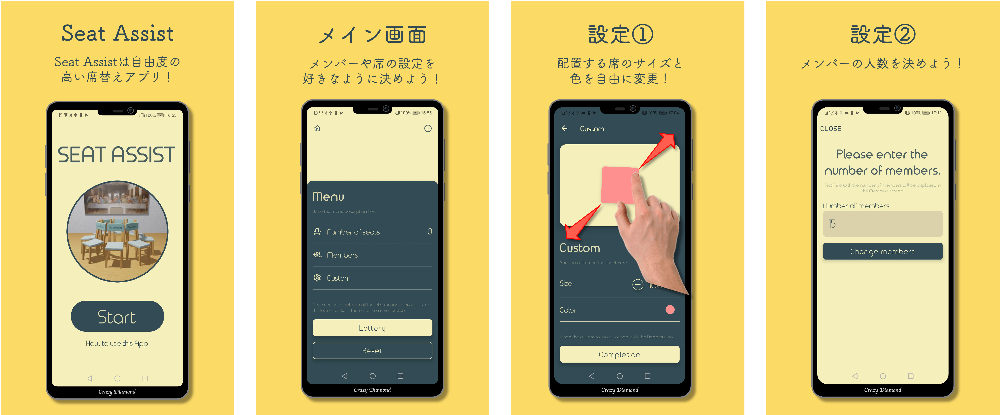
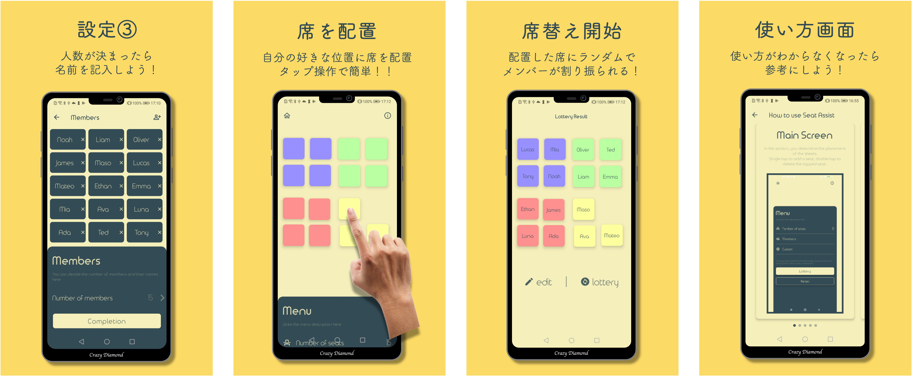

# SeatAssist

<h3>
  私たち「CrazyDiamond」は，飲み会やグループ学習の際に活躍する席替えアプリ「SeatAssist」を開発しています．
</h3>
 

> ## アプリに関して

### Feature graphics

### Screan shot
 

> ### 各画面について
- ### **Main画面**
  - 席の追加・移動・削除を行うことができます。タップで席の追加を、ダブルタップで席の削除ができ、直感的に席を操作することができます。

- ### **Member画面**
  - メンバーの追加・編集・削除を行うことができます。

- ### **Number画面**
  - メンバーの入力を行うテキストフィールドを一括で追加することができます。

- ### **Custom画面**
  - 席の大きさや色を指定することができます。色が5種類あるため、グループ分けなども同時に行うことが可能です。また、席の大きさはピンアウト・ピンインで直感的に変更可能です。

- ### **Lottery画面**
  - 抽選後の席が表示されます。また、再抽選も簡単に行うことが可能です。

- ### **Usage画面**
  - 各画面の使い方についての説明を見ることができます。

> ## 開発に関して

- ### 開発言語
  - kotlin
    - jetpack compose
- ### 開発方式
  - チケット駆動開発
- ### デザインツール
  - blender
  - figma
  - powerpoint
- ### その他開発ツール
  - miro
- ### 開発プラットフォーム
  - android studio
    - arctic Fox
- ### 動作確認OS
  - 11.0

> ## 使い倒しテスト確認項目

- [ ] カスタマイズした色にオブジェクトが変色されるか
- [ ] 画面サイズの異なる端末でUIが崩れない
- [ ] リセットボタンでリストが初期化されるか
- [ ] オブジェクトの配置上限の確認
- [ ] メイン画面からスタート画面，使い方画面に戻った際に状態が残っているか
- [ ] アニメーションによる表示遅延の秒数を確認
- [ ] アプリをスリープにした際に状態が残るか
- [ ] メンバー0人の際に，ダイアログが出るかどうか
- [ ] メンバーと席の数が異なる場合に，ダイアログが出るかどうか
- [ ] アニメーションが全画面に反映されているかどういか
- [ ] MainScreenの席の配置と，LotteryScreenの席の配置が変わっていないか
- [ ] メンバーの人数と，メンバーのテキストフィールドの数が一致するか
- [ ] テキストフィールドに空欄があった場合，例外のダイアログをはくかどうか
- [ ] ナビゲーションのバックボタンで操作しても，メンバー数と，テキストフィールドの数が合うかどうか
- [ ] 席オブジェクトが指定したフィールドの範囲外に操作可能になっていないか．
